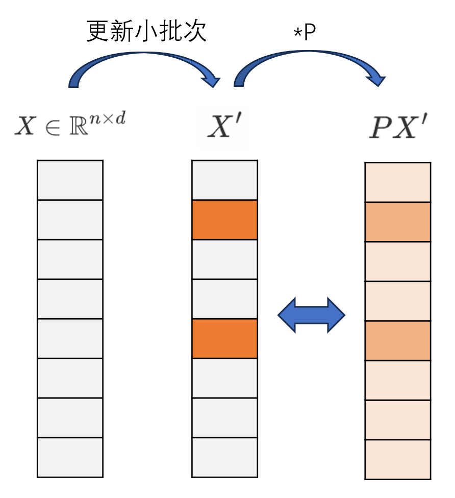

# drug

data:

- entity, desc
- link (head, link, tail)

pre-process:

- entity passage(pos, k\*neg) sim_entity(k)
- head-id link tail-id (以link的index作为Dataset索引)
- head(pos, k\*neg, passage(pos, k\*neg)) link tail(pos, k\*neg, passage(pos, k\*neg))

loss:

- entity reconstruction cross entropy(entity, passage)
- infoNCE(head+link, tail, neg_tail)  (bs, embed_dim),(bs, embed_dim),(bs, k, embed_dim)
- infoNCE(tail-link, head, neg_head)

$$
-\log\frac{e^{s(q)/\tau}}{e^{s(q+)/\tau}+\sum e^{s(q-)/\tau}}
$$

# disease

data:

- entity, symptoms
- link: co-occurrence

loss:

- node-level embedding
- dot product similarity

$$
P=M(\tilde D^{-\frac 12}\tilde A\tilde D^{-\frac 12})^k\in\mathbb R^{n\times n}
$$

- 将node embedding保存为cache，训练模型时每个batch进行推理并更新cache，提高效率



# Environmental preparation

```bash
conda create -n medrec python=3.9
conda activate medrec
conda install -c pytorch faiss-cpu
pip install torch==2.1.0 torchvision==0.16.0 torchaudio==2.1.0 --index-url https://download.pytorch.org/whl/cu118
pip install tqdm==4.67.1 transformers==4.37.2 accelerate==0.33.0 peft==0.12.0 datasets==3.2.0
```

